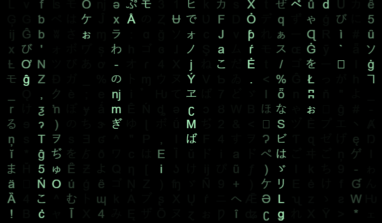

# Matrix Wall

**The Matrix code wall with falling green Unicode characters on a dark background** implemented using Vanilla JavaScript and provided with options for color and style customization.

* Live: https://swharden.github.io/MatrixWall

[](https://swharden.github.io/MatrixWall)

## Quickstart

Add this code anywhere on your site

```html
<script src="https://swharden.github.io/MatrixWall/matrix.js"></script>
```

## Customization

* Colors and styling can be modified by configuring a settings object before loading the script

* Refer to [`src/div.html`](src/div.html) ([view the web page here](https://swharden.github.io/MatrixWall/div.html)) for advanced configuration options

```html
<script type="text/javascript">
    const matrixSettings = {
        target: document.getElementById("matrixDiv"),
        background: "#67217a",
        foreground: "#9a4993",
        characterSize: 15,
    };
</script>
<script src="https://swharden.github.io/MatrixWall/matrix.js"></script>
```

## Disable Translation

* Modify your HTML tag so your browser stops offering to translate the Japanese characters

```html
<html translate="no">
```

## Author

Code here was originally created by [Erdoğan Bavaş](http://erdoganb.com) in [this folder](https://github.com/erdoganbavas/web-practices/tree/master/matrix) but published without a license [(pending #111)](https://github.com/erdoganbavas/web-practices/pull/111) and demonstrated in [this YouTube video](https://www.youtube.com/watch?v=1d7TzlsOHsI). This code was adapted by [@swharden](https://github.com/swharden) in late 2022 to add additional options for customization.