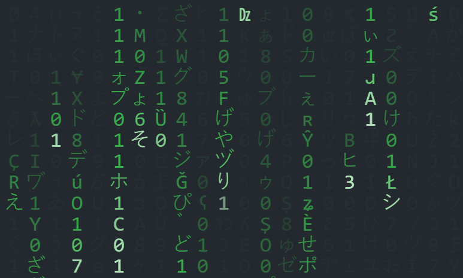

# Matrix Wall

**The Matrix code wall with falling green Unicode characters on a dark background** implemented using Vanilla JavaScript and provided with options for color and style customization.

* Matrix Wall demo: https://swharden.github.io/MatrixWall
* Customized demo: https://swharden.github.io/MatrixWall/div.html
* 💡 Tip: Press `F11` for fullscreen then `F5` to refresh

[](https://swharden.github.io/MatrixWall)

## Quickstart

Add this code anywhere on your site

```html
<script src="https://swharden.github.io/MatrixWall/matrix.js"></script>
```

## Customization

* Colors and styling can be modified by configuring a settings object before loading the script

* Refer to [`src/div.html`](src/div.html) ([view the web page here](https://swharden.github.io/MatrixWall/div.html)) for advanced configuration options

```html
<script type="text/javascript">
    const matrixSettings = {
        target: document.getElementById("matrixDiv"),
        background: "#67217a",
        foreground: "#9a4993",
        highlight: "#ba5db2",
        characterSize: 15,
        speed: .5,
    };
</script>
<script src="https://swharden.github.io/MatrixWall/matrix.js"></script>
```

## Disable Translation

* Modify your HTML tag so your browser stops offering to translate the Japanese characters

```html
<html translate="no">
```

## Attribution

This project extends work by [Erdoğan Bavaş](http://erdoganb.com) which was [shared on GitHub](https://github.com/erdoganbavas/web-practices/tree/master/matrix), [demonstrated on YouTube](https://www.youtube.com/watch?v=1d7TzlsOHsI), and [summarized on Medium](https://erdoganbavas.medium.com/creating-matrix-wall-with-html-css-and-javascript-dc4ea5e23fe7)
